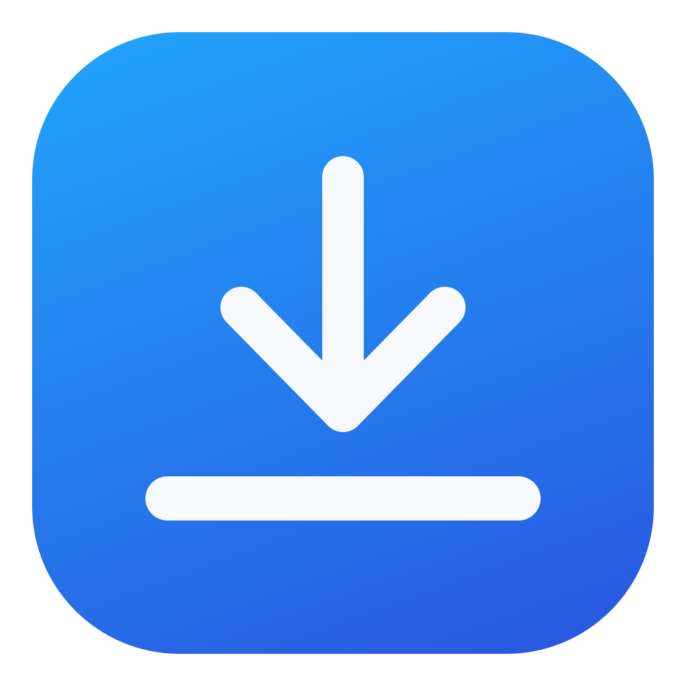

# Shelflet

<p align="center">
  
</p>

A tiny, native, open-source temporary file shelf for macOS — inspired by Dropover.

Pick up a file in Finder, shake it left and right, and Shelflet opens a floating shelf next to the pointer. Drop files there, switch to another app, and drag them out when you are ready.

[Русская версия](#русский)

## Features

- Shake-to-open gesture that only reacts to an active file drag
- Floating shelf that stays above regular and full-screen apps
- Native file drag and drop to Finder, Mail, browsers, and other apps
- Automatically removes a file after a successful transfer
- Automatically hides after the last file is transferred
- Clears unused files after five minutes
- Add Finder files from the clipboard
- Reveal or remove individual files
- Optional launch at login
- No analytics, network access, or Accessibility permission required

## Install

1. Download `Shelflet.zip` from the [latest release](https://github.com/kevozzzy/Shelflet/releases/latest).
2. Unzip it and move `Shelflet.app` to `/Applications`.
3. Open Shelflet. Its tray icon will appear in the menu bar.

The downloadable build is ad-hoc signed, but not Apple-notarized. On first launch, macOS may ask you to allow it in **System Settings → Privacy & Security → Open Anyway**. You can also build it locally from the small, auditable source tree below.

Requires macOS 13 or newer. The release is universal and supports Apple Silicon and Intel Macs.

## Usage

1. Start dragging one or more files in Finder.
2. Quickly move them left and right two or three times.
3. Drop them onto the shelf that appears.
4. Drag them from Shelflet into the destination app.

Drag the shelf by its header. Use the menu-bar icon to show it manually, add clipboard files, clear it, change shake detection, or enable **Launch at Login**.

Shelflet stores references to the original files; it does not copy them into a private folder. Moving or deleting an original file will invalidate its shelf entry.

## Build from source

Install Apple's Command Line Tools. Full Xcode is not required.

```sh
./scripts/test.sh
./scripts/build-app.sh
open ./outputs/Shelflet.app
```

## Privacy

Shelflet works entirely offline. It does not send telemetry, access the network, or retain file contents.

## License

MIT — see [LICENSE](LICENSE).

---

## Русский

Shelflet — нативная временная полка для файлов в macOS, вдохновлённая Dropover.

Начните перетаскивать файл в Finder и быстро покачайте его влево-вправо два–три раза. Положите файл на появившуюся полку, переключитесь в нужное приложение и перетащите его туда.

- Жест срабатывает только во время настоящего перетаскивания файла.
- После успешного переноса файл убирается с полки.
- После переноса последнего файла пустая полка скрывается.
- Неиспользуемая полка очищается через пять минут.
- Окно перемещается за верхнюю шапку и остаётся поверх приложений.
- Автозапуск включается через меню в верхней панели.
- Нет аналитики, сети и требования разрешения Accessibility.

Для сборки нужны macOS 13+ и Command Line Tools. Готовый универсальный Release работает на Apple Silicon и Intel Mac.
